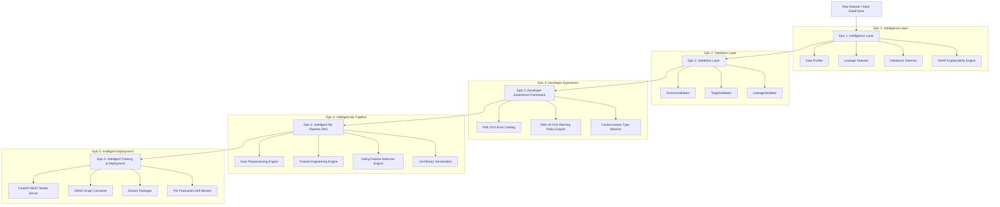
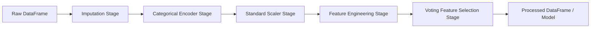

# KiteML Technical Architecture Specification

**KiteML** is an intelligent, full-stack AutoML framework designed to automate dataset profiling, data quality validation, DAG transformation pipeline building, cross-validated model training, REST API serving, containerized deployment, and production drift monitoring.

---

## 🏛️ Ecosystem Architecture Overview

---

## 🔄 Epic 4 — DAG Transformation Execution Engine

All data transformations in KiteML execute as nodes inside a Directed Acyclic Graph (`dag.py`):

### Key Architectural Guarantee: Zero Data Leakage
Transformation parameters (scaler means/variances, target encoding maps, imputation medians) are computed exclusively on training folds during cross-validation. The fitted DAG is then deterministically applied to test and inference sets.

---

## 📦 `.kml` Serialization & SHA-256 Checksum Validation

Pipelines and trained models are stored as native binary `.kml` packages containing:
- `manifest.json`: Metadata, package version, target column, SHA-256 hash.
- `pipeline_dag.pkl`: Serialized DAG transformation state.
- `model_weights.joblib`: Trained model weights.
- `model_card.json`: Lineage and evaluation metrics.

When `KiteMLPipeline.load("model.kml")` is called, the SHA-256 checksum is verified prior to deserialization to guarantee zero tampering or disk corruption.
