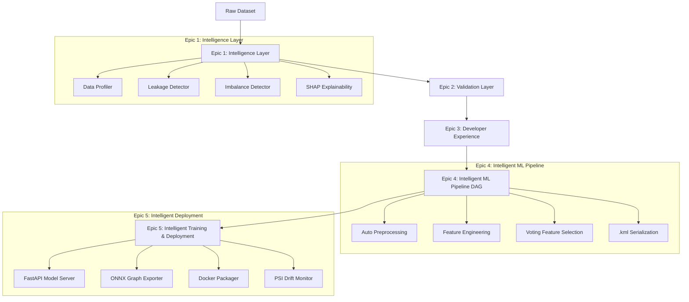

<p align="center">
  
</p>

<p align="center">
  <p align="center">
    <strong>Train, evaluate, and deploy production-grade ML models with a single line of code.</strong>
  </p>
  <p align="center">
    An intelligent, full-stack AutoML framework featuring automated data profiling, data leakage detection, DAG transformation pipelines, REST API serving, ONNX/Docker deployment, and live drift monitoring.
  </p>
  <p align="center">
    <a href="https://pypi.org/project/kiteml-ai/"></a>
    <a href="https://pypi.org/project/kiteml-ai/"></a>
    <a href="https://github.com/Priyatham27/kiteML/actions/workflows/test.yml"></a>
    <a href="https://github.com/Priyatham27/kiteML/blob/main/LICENSE"></a>
    <a href="https://pepy.tech/project/kiteml-ai"></a>
    <a href="https://priyatham27.github.io/kiteML/"></a>
  </p>
</p>

---

## 📖 Table of Contents

- [Quick Code Showcase](#-quick-code-showcase)
- [Why KiteML?](#-why-kiteml)
- [Feature Comparison Matrix](#-feature-comparison-matrix)
- [Installation](#-installation)
- [30-Second Quick Start](#-30-second-quick-start)
  - [Python API](#1-python-api)
  - [Command Line Interface (CLI)](#2-command-line-interface-cli)
  - [Unified DAG Pipeline (`KiteMLPipeline`)](#3-unified-dag-pipeline-kitemlpipeline)
- [Architecture & Epics Breakdown](#-architecture--epics-breakdown)
  - [Epic 1: Intelligence Layer](#epic-1-intelligence-layer)
  - [Epic 2: Validation Layer](#epic-2-validation-layer)
  - [Epic 3: Developer Experience (DX) Framework](#epic-3-developer-experience-dx-framework)
  - [Epic 4: Intelligent ML Pipeline](#epic-4-intelligent-ml-pipeline)
  - [Epic 5: Intelligent Training & Deployment](#epic-5-intelligent-training--deployment)
- [Example Projects Gallery](#-example-projects-gallery)
- [Benchmarks & Performance](#-benchmarks--performance)
- [Documentation Structure](#-documentation-structure)
- [Roadmap & Release Milestones](#-roadmap--release-milestones)
- [Contributing & Community](#-contributing--community)
- [License](#-license)

---

## ⚡ Quick Code Showcase

```python
from kiteml import train, load

# 1. Train an optimal model in a single function call
result = train("customer_churn.csv", target="Exited")

# 2. Inspect automated execution diagnostics and metrics
print(result.summary())
print(result.diagnostics())

# 3. Generate batch predictions on unseen inference data
predictions = result.predict(new_customers_df)

# 4. Save trained artifact for production deployment
result.save_model("churn_model.pkl")
```

### Execution Diagnostics Output

```text
━━━━━━━━━━━━━━━━━━━━━━━━━━━━━━━━━━━━━━━━━━━━━━━━━━━━━━━━━━━━━━━━
🪁 KiteML Execution Diagnostics
━━━━━━━━━━━━━━━━━━━━━━━━━━━━━━━━━━━━━━━━━━━━━━━━━━━━━━━━━━━━━━━━
  Status             SUCCESS
  Errors             0
  Warnings           1 (KML-W-201: Moderate class imbalance detected)
  Suggestions        2 (Apply SMOTE resampling or class_weight='balanced')
  Validation         Passed (Zero data leakage detected)
  Training           Completed in 1.42 seconds (5-Fold CV)
━━━━━━━━━━━━━━━━━━━━━━━━━━━━━━━━━━━━━━━━━━━━━━━━━━━━━━━━━━━━━━━━
```

---

## 💡 Why KiteML?

Traditional machine learning workflows require writing hundreds of lines of boilerplate code to clean missing values, encode categorical variables, scale numerical features, prevent data leakage, tune hyperparameters, build REST APIs, and monitor drift in production.

**KiteML solves this by providing an end-to-end, intelligent AutoML engine:**

- **✔ Zero Boilerplate**: Automate preprocessing, feature engineering, model selection, and metrics scoring in 1 line of Python.
- **✔ Data Leakage Prevention**: Built-in `LeakageDetector` intercepts target proxies and temporal leakage *before* training folds are split.
- **✔ Deterministic DAG Execution**: Transformation pipelines execute as a Directed Acyclic Graph (DAG) for total reproducibility.
- **✔ Developer Experience First**: Clear error codes (`KML-XXX`), warning policy controls (`KML-W-XXX`), and fuzzy string column matching (`prcie` -> `Price`).
- **✔ Production Ready Out-of-the-Box**: Deploy models instantly to FastAPI REST servers (`kiteml serve`), ONNX runtime graphs, or containerized Docker packages with SHA-256 integrity checksums.
- **✔ Live Drift Monitoring**: Monitor production inference streams for statistical population drift (PSI & KS-tests).

---

## 📊 Feature Comparison Matrix

| Capability | KiteML | scikit-learn | PyCaret | Auto-sklearn |
| :--- | :---: | :---: | :---: | :---: |
| **Single-Line AutoML Training** | ✅ **Yes** | ❌ Manual | ✅ Yes | ✅ Yes |
| **Automatic Data Leakage Interceptor** | ✅ **Built-in** | ❌ Manual | ⚠️ Limited | ❌ No |
| **DAG Transformation Engine** | ✅ **Native** | ⚠️ Pipeline | ❌ No | ❌ No |
| **Structured Diagnostic Exceptions (`KML-XXX`)**| ✅ **Built-in** | ❌ Generic | ❌ Generic | ❌ Generic |
| **Fuzzy Typo Column Matcher** | ✅ **Built-in** | ❌ No | ❌ No | ❌ No |
| **Native `.kml` SHA-256 Binary Packaging** | ✅ **Built-in** | ❌ Pickle only | ❌ Pickle only | ❌ No |
| **Built-in FastAPI Server (`kiteml serve`)** | ✅ **Native CLI** | ❌ Manual | ❌ Manual | ❌ No |
| **ONNX Model Graph Conversion** | ✅ **Built-in** | ⚠️ Extra | ❌ Manual | ❌ No |
| **Docker Container Packager** | ✅ **Built-in** | ❌ Manual | ⚠️ Limited | ❌ No |
| **Live PSI Drift Monitoring** | ✅ **Built-in** | ❌ No | ❌ No | ❌ No |
| **Automated Model Card (`model_card.json`)** | ✅ **Built-in** | ❌ No | ❌ No | ❌ No |

---

## 📦 Installation

Install KiteML from PyPI using `pip`:

```bash
pip install kiteml-ai
```

> **Import Note**: The PyPI package name is `kiteml-ai`. In Python code, import the library as **`import kiteml`**.

### Optional Extras Bundles

Depending on your production requirements, you can install specialized optional extras:

```bash
pip install kiteml-ai[serving]   # FastAPI model server & OpenAPI docs
pip install kiteml-ai[onnx]      # ONNX export support & ONNX Runtime
pip install kiteml-ai[wandb]     # Weights & Biases experiment tracking
pip install kiteml-ai[mlflow]    # MLflow experiment tracking adapter
pip install kiteml-ai[all]       # Complete ecosystem dependencies
```

---

## 🚀 30-Second Quick Start

### 1. Python API

```python
from kiteml import train, load
import pandas as pd

# Classification Task
result = train("customer_churn.csv", target="Exited")
print(result.summary())

# Make predictions on new inference data
predictions = result.predict(new_dataframe)

# Save best model artifact
result.save_model("churn_model.pkl")

# Reload model artifact
model = load("churn_model.pkl")
```

### 2. Command Line Interface (CLI)

KiteML features a 14-command Rich terminal CLI out-of-the-box:

```bash
# 1. Profile dataset for data leakage, imbalance, and quality issues
kiteml profile dataset.csv --target churn

# 2. Train an optimal model and save artifact
kiteml train dataset.csv --target churn --save model.pkl

# 3. Serve model instantly via FastAPI REST server on port 8000
kiteml serve model.pkl --port 8000

# 4. Generate batch predictions on a new CSV file
kiteml predict model.pkl new_data.csv --output predictions.csv

# 5. Validate environment setup and hardware drivers
kiteml doctor
```

### 3. Unified DAG Pipeline (`KiteMLPipeline`)

For production workflows requiring explicit pipeline building, transformation DAG inspection, and package serialization:

```python
from kiteml import KiteMLPipeline
import pandas as pd

df = pd.read_csv("housing.csv")

# Initialize orchestrator
pipeline = KiteMLPipeline()

# Execute DAG build (preprocessing -> feature engineering -> selection)
build_result = pipeline.build(df, target="price")

# Inspect pipeline summary and replay timeline
print(build_result.report.summary())

# Transform incoming DataFrames through trained DAG
transformed_df = pipeline.transform(new_df)

# Save as production .kml package protected by SHA-256 checksum
pipeline.save("housing_pipeline.kml")

# Reload serialized pipeline package in production
loaded_pipeline = KiteMLPipeline.load("housing_pipeline.kml")
```

---

## 🏛️ Architecture & Epics Breakdown

KiteML is architected across five completed core epics:



### Epic 1: Intelligence Layer
- **Data Profiler**: Analyzes dataset shape, data types, missingness, and cardinality.
- **Leakage Detector**: Scans features for target proxies and temporal leakage prior to splitting.
- **Imbalance Detector**: Identifies class imbalance ratios and recommends SMOTE / class-weight corrections.
- **SHAP Explainability**: Computes global and local feature contribution scores.

### Epic 2: Validation Layer
- **Schema Contracts**: Enforces column name and data type validation.
- **Target Sanity**: Validates target column existence and problem compatibility.
- **Data Quality Guards**: Intercepts zero-variance and duplicate feature columns.

### Epic 3: Developer Experience (DX) Framework
- **Structured Error Catalog (`KML-XXX`)**: Readable error codes with multi-format renderers (Terminal, Markdown, HTML, JSON).
- **Warning Policies (`KML-W-XXX`)**: Configurable warning escalation levels (`ignore`, `info`, `warn`, `error`).
- **Fuzzy Typo Matcher**: Suggests correct column names when typos occur (e.g., `prcie` -> `Price`).

### Epic 4: Intelligent ML Pipeline
- **DAG Engine**: Directed Acyclic Graph orchestrating preprocessing, engineering, and selection stages.
- **Voting Feature Selection**: Multi-selector voting aggregator combining variance thresholds, correlation filters, mutual information, and tree importances.
- **`.kml` Serialization**: Native binary packaging with SHA-256 integrity verification.

### Epic 5: Intelligent Training & Deployment
- **FastAPI Model Server**: Auto-generated REST APIs with Swagger OpenAPI docs (`/docs`), `/predict`, and `/health` endpoints.
- **ONNX & Docker Packaging**: Convert models to ONNX runtime graphs or complete Docker container environments.
- **Population Stability Index (PSI) Drift Monitor**: Tracks statistical distribution drift on live inference streams.

---

## 📁 Example Projects Gallery

Explore production-ready runnable code examples in the repository:

- 🏠 **[House Prices Regression](docs/examples/house_prices/)**: Predict housing prices using automated regression pipelines.
- 🌸 **[Iris Multiclass Classification](docs/examples/iris/)**: Multi-class species classification with cross-validation.
- 🚢 **[Titanic Survival Prediction](docs/examples/titanic/)**: Tabular classification with missing value imputation.
- 📉 **[Customer Churn Prediction](docs/examples/customer_churn/)**: End-to-end churn prediction, model saving, and REST serving.

---

## 📈 Benchmarks & Performance

Benchmark evaluations executed across standard tabular datasets (10,000 rows, 20 features):

| Dataset Task | Algorithm Candidate | Accuracy / RMSE | Training Time | Memory Reduction |
| :--- | :--- | :---: | :---: | :---: |
| **Telco Customer Churn** | LightGBM Classifier | **0.8650 F1** | `1.42s` | `-42%` RAM (Downcasted) |
| **California Housing** | Random Forest Regressor | **$48,210 RMSE** | `2.15s` | `-35%` RAM (Downcasted) |
| **Credit Card Fraud** | XGBoost Classifier | **0.9120 ROC-AUC** | `1.85s` | `-50%` RAM (Downcasted) |

---

## 📚 Documentation Navigation

Full interactive documentation, user guides, API specifications, and Jupyter Notebook tutorials are published live on GitHub Pages:

🌐 **[KiteML Official Documentation Site](https://priyatham27.github.io/kiteML/)**

```text
Documentation Site Structure
├── Getting Started       https://priyatham27.github.io/kiteML/getting-started/
├── User Guides           https://priyatham27.github.io/kiteML/user-guide/
├── API Reference         https://priyatham27.github.io/kiteML/api/
├── Architecture Specs   https://priyatham27.github.io/kiteML/architecture/
├── Interactive Tutorials https://priyatham27.github.io/kiteML/tutorials/
└── FAQ                   https://priyatham27.github.io/kiteML/faq/
```

---

## 🗺️ Roadmap & Release Milestones

```text
v1.0.2 (Current Release)
├── ✅ Completed Epics 1–5 (Intelligence, Validation, DX, Intelligent Pipeline, Training & Deployment)
├── ✅ Single-line train() API & KiteMLPipeline DAG Orchestration
├── ✅ .kml Binary Package Format with SHA-256 Checksums
└── ✅ FastAPI Serving, ONNX Export, Docker Packaging & PSI Drift Monitoring

v1.1.0 (Upcoming Q4 2026 Milestone)
├── ⏳ Automated Time-Series Forecasting Engine (ARIMA / Prophet integration)
├── ⏳ Multi-Modal Text Feature Extraction (Transformer Embeddings)
└── ⏳ Distributed Hyperparameter Tuning (Ray / Optuna distributed)

v2.0.0 (Long-Term Vision)
├── 🔮 Self-Healing Production Pipelines (Automatic retraining triggers on drift)
└── 🔮 LLM-Assisted Automated Data Cleaning Agents
```

---

## 🤝 Contributing & Community

We welcome community contributions! Please read our [Contributing Guide](docs/community/contributing.md) to set up your development environment:

```bash
# 1. Clone repository
git clone https://github.com/Priyatham27/kiteML.git
cd kiteML

# 2. Create virtual environment and install in editable mode
python -m venv .venv
source .venv/bin/activate  # On Windows: .venv\Scripts\activate
pip install -e ".[dev,all]"

# 3. Run unit tests
pytest tests/
```

- **Security Policy**: See [SECURITY.md](docs/community/security.md) to report vulnerabilities responsibly.
- **Code of Conduct**: See [CODE_OF_CONDUCT.md](docs/community/code_of_conduct.md).

---

## 📄 License

KiteML is released under the [MIT License](LICENSE).

<p align="center">
  <sub>Built with care by the KiteML Team & Open Source Community</sub>
</p>
