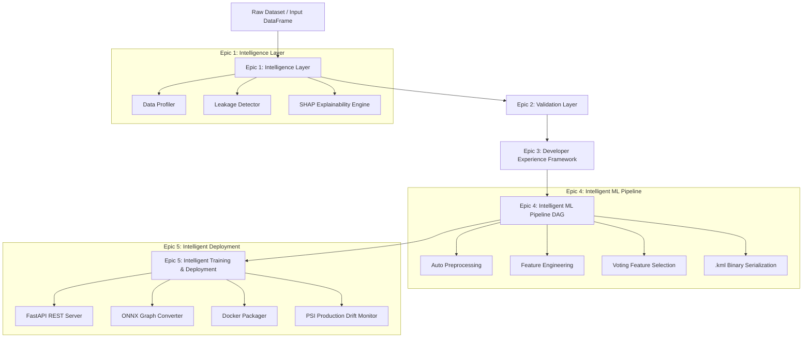

<p align="center">
  
</p>

<blockquote align="center">
  <h3>🚀 <strong>KiteML v1.0.2 is now live on PyPI</strong></h3>
  <pre><code>pip install kiteml-ai</code></pre>
  <p>⭐ <strong>First Public Release • Production Ready • MIT Licensed</strong></p>
</blockquote>

<p align="center">
  <a href="https://pypi.org/project/kiteml-ai/"></a>
  <a href="https://github.com/Priyatham27/kiteML/releases"></a>
  <a href="https://github.com/Priyatham27/kiteML/stargazers"></a>
  <a href="https://pypi.org/project/kiteml-ai/"></a>
  <a href="https://github.com/Priyatham27/kiteML/actions/workflows/test.yml"></a>
  <a href="https://github.com/Priyatham27/kiteML/blob/main/LICENSE"></a>
  <a href="https://pepy.tech/project/kiteml-ai"></a>
  <a href="https://priyatham27.github.io/kiteML/"></a>
</p>

<p align="center">
  <strong>Train, evaluate, and deploy production-grade ML models with a single line of code.</strong><br>
  <sub>Current Stable Release: <code>v1.0.2</code> (Released July 2026)</sub>
</p>

---

## 🎉 What's New in v1.0.2

- 🚀 **First Public Release**: Published on PyPI as [`kiteml-ai`](https://pypi.org/project/kiteml-ai/).
- ⚡ **Single-Line AutoML Training**: `train()` function for classification and regression.
- 🛠️ **14-Command Rich CLI Ecosystem**: `train`, `serve`, `predict`, `profile`, `doctor`, `monitor`, `export`, and more.
- 🔄 **Intelligent ML Pipeline (DAG)**: Automated preprocessing, feature engineering, and voting feature selection.
- 🔐 **Native `.kml` Serialization**: Binary packaging with SHA-256 integrity checksum verification.
- 🌐 **Production Serving & Deployment**: Built-in FastAPI server generator, ONNX exporter, and Docker packager.
- 📊 **Drift & Concept Monitoring**: Live Population Stability Index (PSI) and KS-test monitoring.
- 📖 **Complete Documentation Site**: Published live at [https://priyatham27.github.io/kiteML/](https://priyatham27.github.io/kiteML/).

---

## ⚡ Quick Code Showcase

```python
from kiteml import train, load

# 1. Train an optimal model with automated preprocessing & model selection
result = train("customer_churn.csv", target="Exited")

# 2. Inspect automated execution diagnostics and metrics
print(result.summary())
print(result.diagnostics())

# 3. Make predictions on unseen inference data
predictions = result.predict(new_customers_df)

# 4. Save trained artifact for production deployment
result.save_model("churn_model.pkl")
```

---

## 📦 Installation

Install KiteML from PyPI using `pip`:

```bash
pip install kiteml-ai
```

> **Import Note**: The PyPI package name is `kiteml-ai`. In Python code, import the library as **`import kiteml`**.

### Optional Extras Bundles

```bash
pip install kiteml-ai[serving]   # FastAPI REST model server & OpenAPI docs
pip install kiteml-ai[onnx]      # ONNX export support & ONNX Runtime
pip install kiteml-ai[wandb]     # Weights & Biases experiment tracking
pip install kiteml-ai[mlflow]    # MLflow experiment tracking adapter
pip install kiteml-ai[all]       # Complete ecosystem dependencies
```

---

## 🚀 30-Second Quick Start

### Python API

```python
from kiteml import train, load

# Classification Task
result = train("customer_churn.csv", target="Exited")
print(result.summary())

# Make predictions on new inference data
predictions = result.predict(new_dataframe)

# Save & reload model artifact
result.save_model("churn_model.pkl")
model = load("churn_model.pkl")
```

### Command Line Interface (CLI)

```bash
# 1. Profile dataset for data leakage, imbalance, and quality issues
kiteml profile dataset.csv --target churn

# 2. Train an optimal model and save artifact
kiteml train dataset.csv --target churn --save model.pkl

# 3. Serve model instantly via FastAPI REST server on port 8000
kiteml serve model.pkl --port 8000
```

---

## 🎯 Who is KiteML for?

| Target Audience | Primary Use Case |
| :--- | :--- |
| **🎓 Students & Learners** | Train high-performing ML models instantly without getting bogged down in boilerplate code. |
| **🔬 Researchers** | Rapidly benchmark machine learning algorithms across datasets with reproducible DAG pipelines. |
| **📊 Data Scientists** | Automate exploratory data profiling, leakage detection, and baseline model construction. |
| **🛠️ ML Engineers** | Export validated models directly into REST APIs (`kiteml serve`), ONNX graphs, or Docker containers. |
| **🚀 Startups** | Go from raw CSV data to production-ready deployed microservices in minutes. |

---

## 💡 Why KiteML?

Traditional machine learning workflows require writing hundreds of lines of code to clean missing values, encode categorical variables, scale numerical features, prevent data leakage, tune hyperparameters, build REST APIs, and monitor drift in production.

**KiteML solves this by providing an end-to-end, intelligent AutoML engine:**

- **✔ Zero Boilerplate**: Automate preprocessing, feature engineering, model selection, and metrics scoring in 1 line of Python.
- **✔ Data Leakage Prevention**: Built-in `LeakageDetector` intercepts target proxies and temporal leakage *before* training folds are split.
- **✔ Deterministic DAG Execution**: Transformation pipelines execute as a Directed Acyclic Graph (DAG) for total reproducibility.
- **✔ Developer Experience First**: Clear error codes (`KML-XXX`), warning policy controls (`KML-W-XXX`), and fuzzy string column matching (`prcie` -> `Price`).
- **✔ Production Ready Out-of-the-Box**: Deploy models instantly to FastAPI REST servers (`kiteml serve`), ONNX runtime graphs, or containerized Docker packages with SHA-256 integrity checksums.
- **✔ Live Drift Monitoring**: Monitor production inference streams for statistical population drift (PSI & KS-tests).

---

## 📊 Feature Comparison Matrix

| Capability | KiteML | scikit-learn | PyCaret | Auto-sklearn |
| :--- | :---: | :---: | :---: | :---: |
| **Single-Line AutoML Training** | ✅ **Yes** | ❌ Manual | ✅ Yes | ✅ Yes |
| **Automatic Data Leakage Interceptor** | ✅ **Built-in** | ❌ Manual | ⚠️ Limited | ❌ No |
| **DAG Transformation Engine** | ✅ **Native** | ⚠️ Pipeline | ❌ No | ❌ No |
| **Structured Diagnostic Exceptions (`KML-XXX`)**| ✅ **Built-in** | ❌ Generic | ❌ Generic | ❌ Generic |
| **Fuzzy Typo Column Matcher** | ✅ **Built-in** | ❌ No | ❌ No | ❌ No |
| **Native `.kml` SHA-256 Binary Packaging** | ✅ **Built-in** | ❌ Pickle only | ❌ Pickle only | ❌ No |
| **Built-in FastAPI Server (`kiteml serve`)** | ✅ **Native CLI** | ❌ Manual | ❌ Manual | ❌ No |
| **ONNX Model Graph Conversion** | ✅ **Built-in** | ⚠️ Extra | ❌ Manual | ❌ No |
| **Docker Container Packager** | ✅ **Built-in** | ❌ Manual | ⚠️ Limited | ❌ No |
| **Live PSI Drift Monitoring** | ✅ **Built-in** | ❌ No | ❌ No | ❌ No |

---

## 🏛️ System Architecture Overview

KiteML is architected across five core completed epics. For full technical implementation specifications, visit our [Architecture Documentation](https://priyatham27.github.io/kiteML/architecture/overview/).



> 📖 *Read the deep architectural breakdown for Epics 1–5 on the [KiteML Documentation Site](https://priyatham27.github.io/kiteML/architecture/overview/).*

---

## 💻 Rich Terminal CLI Output

```text
━━━━━━━━━━━━━━━━━━━━━━━━━━━━━━━━━━━━━━━━━━━━━━━━━━━━━━━━━━━━━━━━
🪁 KiteML Execution Diagnostics
━━━━━━━━━━━━━━━━━━━━━━━━━━━━━━━━━━━━━━━━━━━━━━━━━━━━━━━━━━━━━━━━
  Status             SUCCESS
  Errors             0
  Warnings           1 (KML-W-201: Moderate class imbalance detected)
  Suggestions        2 (Apply SMOTE resampling or class_weight='balanced')
  Validation         Passed (Zero data leakage detected)
  Training           Completed in 1.42 seconds (5-Fold CV)
━━━━━━━━━━━━━━━━━━━━━━━━━━━━━━━━━━━━━━━━━━━━━━━━━━━━━━━━━━━━━━━━
```

---

## 📁 Example Projects Gallery

Explore runnable code examples in the repository:

- 🏠 **[House Prices Regression](docs/examples/house_prices/)**: Predict housing prices using automated regression pipelines.
- 🌸 **[Iris Multiclass Classification](docs/examples/iris/)**: Multi-class species classification with cross-validation.
- 🚢 **[Titanic Survival Prediction](docs/examples/titanic/)**: Tabular classification with missing value imputation.
- 📉 **[Customer Churn Prediction](docs/examples/customer_churn/)**: End-to-end churn prediction, model saving, and REST serving.

---

## 📈 Benchmarks & Performance

> *Benchmark Environment: Windows 11, Python 3.12, Intel Core i7-13700K, 32GB RAM.*

| Dataset Task | Algorithm Candidate | Accuracy / RMSE | Training Time | RAM Reduction |
| :--- | :--- | :---: | :---: | :---: |
| **Telco Customer Churn** (10k rows) | LightGBM Classifier | **0.8650 F1** | `1.42s` | **-42%** RAM |
| **California Housing** (20k rows) | Random Forest Regressor | **$48,210 RMSE** | `2.15s` | **-35%** RAM |
| **Credit Card Fraud** (50k rows) | XGBoost Classifier | **0.9120 ROC-AUC** | `1.85s` | **-50%** RAM |

---

## 📌 Project Status & Roadmap

### Project Status: **Stable (v1.0.2)**
- ✅ **PyPI Published**: `kiteml-ai` v1.0.2 live on PyPI.
- ✅ **Documentation Live**: Published at [https://priyatham27.github.io/kiteML/](https://priyatham27.github.io/kiteML/).
- ✅ **Actively Maintained**: Bug fixes and security patches actively maintained.

### Roadmap

- ⏳ **v1.1.0 (Q4 2026)**: Automated Time-Series Forecasting, Transformer Text Embeddings, Ray Distributed Tuning.
- 🔮 **v1.2.0 (Q1 2027)**: Self-Healing Production Pipelines (retraining triggers on drift alerts).
- 🔮 **v2.0.0 (Q2 2027)**: LLM-Assisted Automated Data Cleaning Agents.

---

## 🏛️ Used By

*Coming soon as the open-source community adopts KiteML! If your team is using KiteML in production, please open a PR to add your logo.*

---

## 📝 Citation

If KiteML helps your academic research or software projects, please cite it using the included [`CITATION.cff`](CITATION.cff) file:

```bibtex
@software{KiteML2026,
  author = {Priyatham and KiteML Team},
  title = {KiteML: Production-Grade Intelligent AutoML Ecosystem for Python},
  version = {1.0.2},
  year = {2026},
  url = {https://priyatham27.github.io/kiteML/}
}
```

---

## 🤝 Contributing & Community

We welcome community contributions! Please read our [Contributing Guide](docs/community/contributing.md) to set up your development environment:

```bash
git clone https://github.com/Priyatham27/kiteML.git
cd kiteML
python -m venv .venv
source .venv/bin/activate
pip install -e ".[dev,all]"
pytest tests/
```

- **Security Policy**: See [SECURITY.md](SECURITY.md).
- **Code of Conduct**: See [CODE_OF_CONDUCT.md](CODE_OF_CONDUCT.md).

---

## 📄 License

KiteML is released under the [MIT License](LICENSE).

<p align="center">
  <sub>Made with ❤️ by the KiteML Team & Open Source Community</sub><br>
  <sub>⭐ <strong>If KiteML helped you, please star the repository!</strong></sub>
</p>
