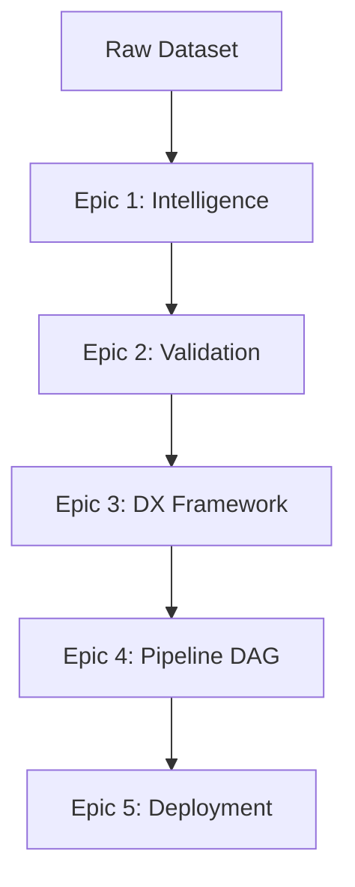

# System Diagrams

## 1. High-Level Ecosystem Flow

```mermaid
graph TD
    RawData[Raw Dataset] --> Intel[Epic 1: Intelligence]
    Intel --> Valid[Epic 2: Validation]
    Valid --> DX[Epic 3: DX Framework]
    DX --> DAG[Epic 4: Pipeline DAG]
    DAG --> Deploy[Epic 5: Deployment]
```

## 2. DAG Transformation Flow

```mermaid
graph LR
    Input[Input DataFrame] --> Preproc[Preprocessing]
    Preproc --> FE[Feature Engineering]
    FE --> FS[Feature Selection]
    FS --> Predict[Model Prediction]
```
