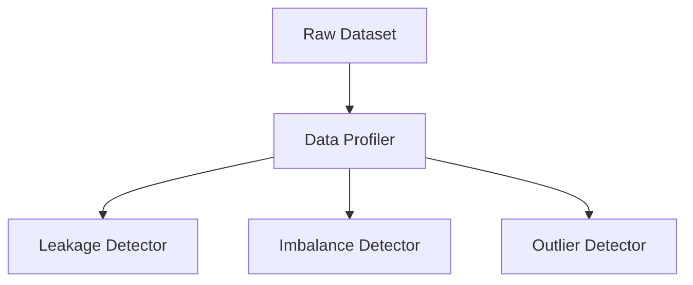

# Epic 1 Architecture: Intelligence Layer

The Intelligence Layer scans raw data to detect data leakage, high cardinality, class imbalance, and memory optimization opportunities.

```mermaid
graph TD
    RawData[Raw Dataset] --> Profiler[Data Profiler]
    Profiler --> Leakage[Leakage Detector]
    Profiler --> Imbalance[Imbalance Detector]
    Profiler --> Outlier[Outlier Detector]
```
