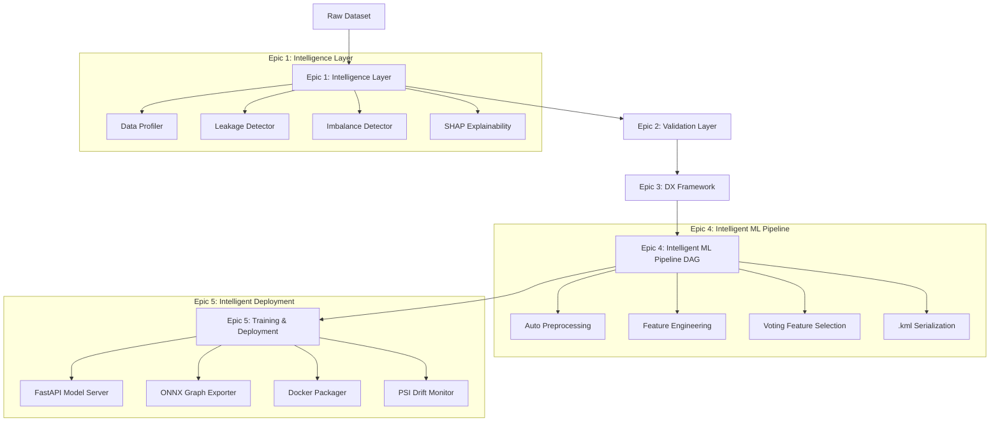

# System Architecture Overview

KiteML is architected as a modular, 5-epic AutoML ecosystem that processes raw tabular datasets through data intelligence scanning, pre-flight quality validation, DAG pipeline execution, cross-validated training, REST API serving, and drift monitoring.

---

## 🏛️ Ecosystem Architecture Diagram

