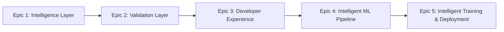
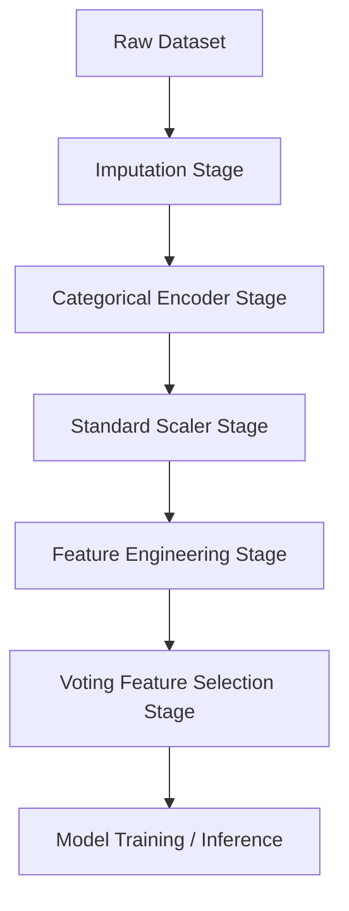

# Core Concepts & Architectural Foundation

To effectively build, deploy, and customize workflows in **KiteML**, it is helpful to understand the underlying architectural design principles across its 5 completed epics.

---

## 1. The 5 Completed Architecture Epics



### Epic 1 — Intelligence Layer
Scans raw tabular datasets for statistical distribution quirks, high cardinality, severe class imbalance, data leakage risks, and non-linear feature importances (SHAP).

### Epic 2 — Validation Layer
Enforces pre-flight quality contracts. Checks target column sanity, data type schemas, zero-variance columns, and prevents future information leakage across validation splits.

### Epic 3 — Developer Experience (DX) Framework
A diagnostic system that intercepts runtime failures, assigns catalog codes (`KML-XXX`), manages escalation warning policies (`KML-W-XXX`), and runs fuzzy string matching (`match_column_name`) to suggest fixes for column typos.

### Epic 4 — Intelligent ML Pipeline
Automates data preprocessing, feature engineering, and multi-selector voting feature selection into a Directed Acyclic Graph (DAG). Packages pipelines into native `.kml` binary bundles with SHA-256 integrity verification.

### Epic 5 — Intelligent Training & Deployment
Executes stratified k-fold cross-validated model selection, hyperparameter tuning, FastAPI web serving, ONNX model graph export, Docker container packaging, and production population stability drift monitoring (PSI/KS-test).

---

## 2. The Directed Acyclic Graph (DAG) Engine

All transformations in KiteML (imputation, scaling, encoding, feature creation, feature selection) are represented as node stages in a **DAG pipeline**. 



Key Advantages of the DAG Design:
- **Zero Data Leakage**: Encoders and scalers fit parameters exclusively on training folds, applying fitted transformations to test/inference sets.
- **Reproducibility**: Pipeline states are deterministically replayable via execution logs.
- **Serialization**: Saved as single `.kml` package files.

---

## 3. The Developer Experience (DX) Diagnostics

Instead of cryptic traceback dumps, KiteML outputs clear diagnostic feedback:

```text
━━━━━━━━━━━━━━━━━━━━━━━━━━━━━━━━━━━━━━━━━━━━━━━━━━━━━━━━━━━━━━━━
🪁 KiteML Execution Diagnostics
━━━━━━━━━━━━━━━━━━━━━━━━━━━━━━━━━━━━━━━━━━━━━━━━━━━━━━━━━━━━━━━━
  Status             SUCCESS
  Errors             0
  Warnings           1 (KML-W-201: Class imbalance ratio 8.2:1)
  Suggestions        2 (Use SMOTE resampling or class_weight='balanced')
  Validation         Passed (Zero data leakage detected)
  Training           Completed in 1.42s
━━━━━━━━━━━━━━━━━━━━━━━━━━━━━━━━━━━━━━━━━━━━━━━━━━━━━━━━━━━━━━━━
```

---

## Next Steps

- Explore [Epic 4 User Guides](../user_guides/pipeline/dag_orchestration.md) to build custom pipelines.
- Read the [API Reference](../api/core.md) for detailed signature documentation.
