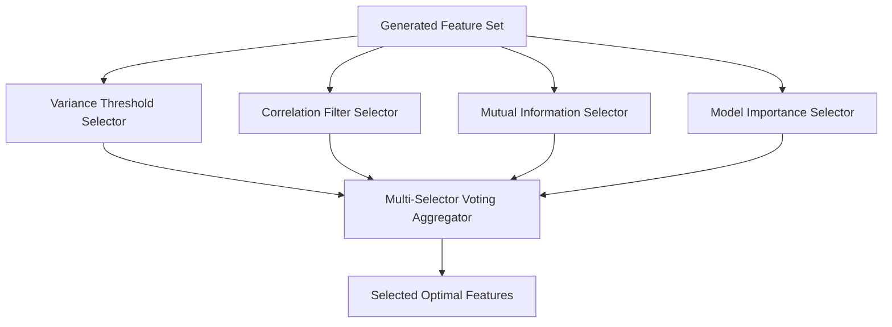

# Voting Feature Selection Engine

KiteML implements a **multi-selector voting system** (`kiteml.feature_selection`) to identify and preserve highly predictive features while eliminating uninformative or noisy columns.

---

## 1. Multi-Selector Voting Mechanics

Instead of relying on a single feature selection heuristic, KiteML aggregates four independent selector algorithms:



### Selector Algorithms:
1. **Variance Threshold**: Eliminates constant and near-zero variance features (`variance < 0.01`).
2. **Correlation Filter**: Removes highly collinear redundant features (`|r| > 0.95`).
3. **Mutual Information**: Measures non-linear dependency with target variable.
4. **Tree Importance**: Evaluates split gains using a fast preliminary Random Forest / LightGBM model.

---

## 2. Voting Thresholds

Each feature receives a vote (0 to 4) from the selectors. Features meeting the consensus threshold (default `>= 2` votes) are retained in the final DAG pipeline.

```python
from kiteml.feature_selection import VotingFeatureSelector

selector = VotingFeatureSelector(min_votes=2, max_features=50)
selected_df = selector.fit_transform(X, y)

print(f"Features reduced from {X.shape[1]} to {selected_df.shape[1]}")
```
