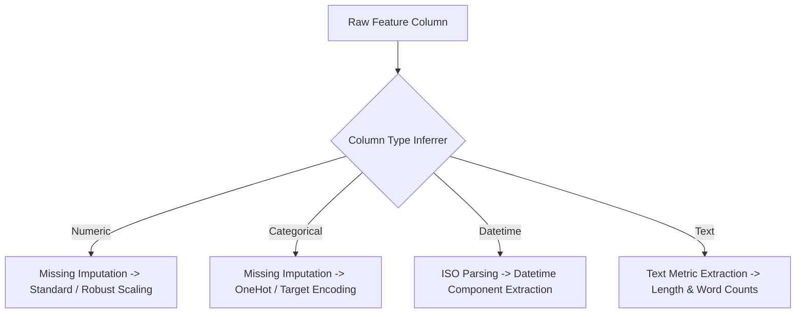

# Automated Preprocessing, Scaling & Encoding

KiteML's `preprocessing` module automatically analyzes column statistical properties and generates an optimal transformation pipeline.

---

## 1. Automated Preprocessing Strategy

When `train()` or `KiteMLPipeline.build()` is invoked, the `Planner` generates a preprocessing blueprint:



---

## 2. Programmatic Preprocessing Customization

You can explicitly configure preprocessing strategies:

```python
from kiteml.preprocessing import PreprocessingPlanner

planner = PreprocessingPlanner(
    numeric_strategy="median",
    scaling_strategy="standard",
    categorical_strategy="onehot",
    handle_unknown="ignore",
)

blueprint = planner.create_blueprint(df, target="price")
```

---

## 3. Supported Scalers & Encoders

- **Scalers**: Standard Scaler (`(x - μ) / σ`), MinMax Scaler (`[0, 1]`), Robust Scaler (IQR-based for outlier resilience).
- **Encoders**: One-Hot Encoding (low cardinality `< 10`), Target Encoding (high cardinality), Frequency Encoding, Ordinal Encoding.
